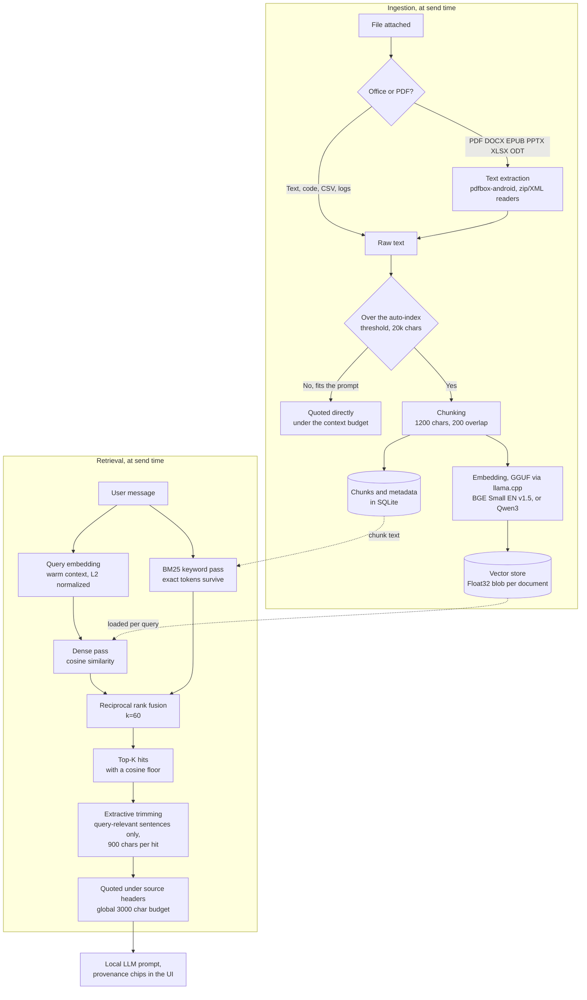

<div align="center">


# PocketMind

**A private, autonomous AI that runs entirely on your phone.**

A focus on knowledge, autonomy, and running your own local models - no
cloud, no account, no telemetry. Built and tested on a Pixel 8 Pro
running GrapheneOS. **Android only.**

<table align="center"><tr>
<td><a href="https://github.com/tokenbleed/pocketmind/releases"></a></td>
<td><a href="https://github.com/tokenbleed/pocketmind/releases/latest"></a></td>
</tr></table>

Releases are a single universal APK: Android 7.0 (API 24) and newer,
arm64-v8a and x86_64, no per-device variants.

</div>

## What PocketMind aims to accomplish

A chat client for local GGUF models is the floor, not the goal. PocketMind
turns the phone into the whole stack:

1. **Knowledge, not just chat.** A local knowledge base: documents are
   chunked, embedded, and retrieved per question (hybrid BM25 + dense
   cosine, fused with RRF). The model answers from your files, cites them
   in-chat, and everything stays on the device.
2. **Autonomy.** Long-running local agents: a sandboxed file workspace the
   model can read and write, tool use with hard guardrails, and connectors
   to services you already use. The phone becomes an assistant that works
   while you are not looking at it.
3. **Fast, honest UX for local inference.** Local tokens are slow (single
   digits per second), so the UI must budget them like a scarce resource:
   extractive quote trimming, retrieval receipts on every message, warm
   contexts, and visible provenance for what went into each prompt.
4. **Degoogled-first.** Distributed as plain APKs via GitHub releases for
   Obtainium users. No Play Services dependency for core features.

## Shipped

- **File attachments**: share or attach any text-like file (code, markdown,
  CSV, logs, config) into chat; content is injected into the prompt with a
  context-aware budget
- **Knowledge base (RAG)**: oversized attachments index automatically;
  retrieval quotes the relevant excerpts under source headers; BM25 +
  embeddings run on-device (BGE Small EN v1.5 by default, Qwen3-Embedding
  as a quality option)
- **Chat provenance**: KB badge on the input and per-message "N KB excerpts
  from file" chips, so you always see whether retrieval fired
- **Document extraction**: PDF, DOCX, EPUB, PPTX, XLSX, and ODT files are
  text-extracted at attach time (pdfbox-android for PDFs, pure-JS zip/XML
  readers for the rest), so they feed chat and the knowledge base
- **Agent workspace**: sandboxed `list_files`, `read_file`, `write_file`,
  and `grep_files` talents with strict path jailing, so a Pal can keep
  notes and files across turns; a Workspace screen in the drawer browses
  everything a Pal wrote (preview, share, delete)
- **Non-blocking attachments**: oversized files no longer stall the first
  answer; the send goes out with a budget-capped head slice while the full
  document indexes into the knowledge base in the background, under the
  same foreground service. The next question gets full retrieval. A
  reactive progress strip above the input shows extraction and indexing
  ("Reading report.pdf", "chunk 12/85")
- **Faster indexing**: the embedding context runs on the CPU's full
  recommended thread count instead of a fixed 4, and is pre-warmed during
  file extraction, hiding model-load latency
- **Background runs**: every generation runs under an Android foreground
  service (dataSync type) with a progress notification, so a long agent
  run survives the app being backgrounded or the screen turning off;
  the notification follows agent steps and tool calls
- **Share sheet intake**: send selected text or shared links into a chat
  from any app (ACTION_SEND / ACTION_PROCESS_TEXT); text lands in the
  input, never auto-sends
- **Local API server**: OpenAI-compatible `/v1/chat/completions` and
  `/v1/models` endpoints served from the loaded model over LAN (loopback
  default, key required when opened up)
- **Latency pack**: extractive sentence-level quote trimming, tuned defaults,
  warm embedding context

## How the knowledge base works

Everything below runs on the phone, with no network call anywhere in the
path. Documents take two routes depending on size, and every send runs a
hybrid retrieval pass:



Two design notes behind the shape of that graph:

- **Hybrid retrieval, not dense-only.** Small embedding models blur exact
  tokens such as IDs, error codes, and file names; BM25 nails those. Both
  passes run on every query and fuse through RRF, which needs no shared
  score scale. If the embedding model is missing, retrieval degrades to
  keyword-only instead of failing the chat.
- **Brute-force beats an index at phone scale.** A few thousand chunks by
  384 dims is a couple million multiplies per query, so plain dot products
  in JS outpace any index structure while keeping the corpus a set of
  plain files.

## Roadmap

- Telegram connector (Bot API) for messages and files in and out

## Engineering notes

An honest admission first: given a free hand, this would have been written
in Kotlin as a native app. Forking the React Native codebase was the
faster path to a working product, and shipping something users can run
outranks writing it in the right language. The tradeoff is a bigger APK
and a JS layer between the UI and llama.cpp.

A size-and-speed audit of the current codebase, in impact order:

1. **Decide the fate of on-device TTS.** The single biggest slab in the
   APK is `libonnxruntime.so` at 32 MB per ABI, 64 MB across both, and
   it exists solely for the optional voice engines (kitten, kokoro,
   supertonic) that `@pocketpalai/react-native-speech` drives with ONNX
   models. No app code imports it directly. Keeping voice costs 64 MB
   in every install; dropping TTS cuts the APK by a third.
2. **Strip the PalsHub cloud layer.** `@supabase/supabase-js`, the
   Firebase app-check BoM, Google Sign-In, Play Billing, and Chrome
   Custom Tabs all exist for upstream's community hub and checkout.
   None of it serves an offline fork, and it drags Play Services
   dependencies into a degoogled build.
3. **Enable R8 minification and resource shrinking.** Release builds
   currently ship with `minifyEnabled false` (upstream default). Turning
   on R8 plus `shrinkResources` trims DEX and assets; it needs a
   validation pass on device because native-module reflection breaks
   without the right keep rules.
4. **Virtualize the message list.** Chat renders every message inside a
   ScrollView, so each token re-renders the whole transcript. A windowed
   list (or `React.memo` on message rows) cuts per-token JS work on long
   sessions.
5. **Live with the llama.cpp weight.** Six CPU-variant `.so` files at
   ~10 MB each plus Hexagon DSP assets, per ABI, are what make the
   178 MB APK. That is the price of one universal binary that runs on
   everything from a 2016 arm64 phone to a Hexagon-backed flagship;
   per-ABI splits would halve downloads but we ship universal only.

## Development

```bash
yarn install
yarn lint
yarn test
cd android && ./gradlew assembleProdRelease
```

Android-only fork: the iOS project, fastlane lanes, and CI jobs were
removed. To build for iOS again, restore them from upstream.

## License

MIT. PocketMind builds on the MIT-licensed
[PocketPal AI](https://github.com/a-ghorbani/pocketpal-ai) by Asghar
Ghorbani; see [LICENSE](./LICENSE) for the full notice.
