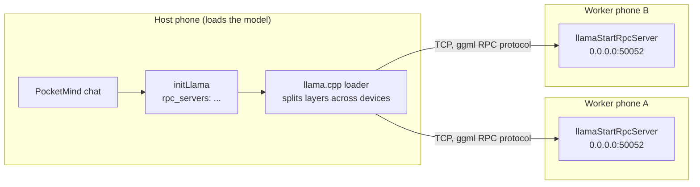

# Multi-phone pooled compute

Status: experimental feature (v1.19.0). Lets one phone run models larger than
its own RAM by borrowing memory and compute from other phones on the same
network running PocketMind in worker mode. Powered by ggml's RPC backend,
vendored into `node_modules/llama.rn` via patch-package.

## How it works

- **Host side.** Settings, Pooled compute, Worker phones: enter one `ip:port`
  per line. On the next model load, `ModelStore.proceedWithInitialization`
  passes the validated endpoints to `initLlama` as `rpc_servers`. The native
  layer registers an RPC backend per endpoint (`rnllama::addRpcServers`), the
  llama.cpp loader then assigns model layers round-robin across all known
  devices, local CPU/GPU included. If no local device was configured, the
  local CPU is still appended so the host contributes to the pool.
- **Worker side.** Settings, Pooled compute, Lend this phone: runs
  `llamaStartRpcServer`, a TCP server (`0.0.0.0`, default port 50052) that
  executes ggml tensor ops sent by the host. The worker needs no model file;
  the host streams weights over the connection.

Both roles can be active on the same phone at once (a phone can host one
model while lending spare memory to another host), but expect heavy
contention: the two llama.cpp runtimes will fight for the same cores. For
best results, dedicate each phone to one role.

## Setup walkthrough

1. Connect all phones to the same Wi-Fi (or one phone's hotspot; a private
   hotspot is the safest option since it isolates the pool from other LANs).
2. On every spare phone: install PocketMind, Settings, Pooled compute,
   enable **Lend this phone**. Note the IP address shown on the phone's
   Wi-Fi details page (the status line shows the port only).
3. On the main phone: Settings, Pooled compute, **Worker phones**, enter
   each worker as `ip:port` (one per line, e.g. `192.168.1.5:50052`).
4. Load a model larger than usual. The endpoint list is applied at model
   load time; entries that fail to connect are skipped.

Android hotspot note: the device hosting the hotspot is always `192.168.43.1`
(or `192.168.x.1` on newer builds), clients get addresses in the same /24.

## Performance expectations

- Wi-Fi bandwidth is the bottleneck for both load time and token rate. On
  802.11ac expect model loads several times slower than local, and prompt
  processing noticeably slower. Generation speed is dominated by the slowest
  phone in the pool.
- Phones throttle under sustained load. A worker running flat out will heat
  up and eventually clock down; keep workers plugged in and screen-off.
- The pool total is capped by the weakest device: the loader assigns
  roughly equal layer counts per device, so one 4 GB phone plus one 12 GB
  phone tops out near 8 GB of model.

## Security model (read before enabling)

There is **no authentication and no encryption** on the RPC connection;
this is upstream ggml-rpc behavior. Anyone who can reach the worker's TCP
port can submit arbitrary tensor ops, and a malicious host could keep a
worker's CPU saturated. Concretely:

- Only enable worker mode on a network you control: a private hotspot or a
  home LAN you trust. Never on public/cafe/airport/hotel Wi-Fi.
- A worker does not grant access to files, contacts, or anything outside
  the compute server; but it is an unauthenticated compute service
  nonetheless.
- The host executes inference on workers it lists by IP. Endpoint entries
  are not validated beyond `ip:port` shape, so double-check what you type.
- If a listed endpoint is unreachable, connection attempts are blocking and
  can take several seconds per dead IP before it is skipped. This stalls
  model load; remove stale entries when a phone leaves the network.

## Implementation notes

- `node_modules/llama.rn/cpp/ggml-rpc.{h,cpp}` and `transport.{h,cpp}` are
  vendored from llama.cpp (upstream commit `74ce157`) with the ggml symbols
  renamed (`ggml_` to `lm_ggml_`) to match the vendored build, plus a stop
  flag so the accept loop can be shut down cleanly.
- `node_modules/llama.rn/cpp/rn-rpc.{h,cpp}` adds
  `rnllama::addRpcServers` (host side, called from `RNLlamaJSI.cpp` when
  `rpc_servers` is present in context params) and
  `rnllama::startRpcServer/stopRpcServer` (worker side), exposed to JS as
  `startRpcServer`/`stopRpcServer`.
- `rpc_servers` is deliberately not part of the persisted
  `ContextInitParams`: worker IPs are transient network state, not model
  configuration, so they do not version-bump the settings schema.
- All of it lives in `patches/llama.rn+0.13.0-rc.0.patch` (source, JSI,
  prebuilt `lib/` mirrors, CMake for both platforms), applied on
  `yarn install` by patch-package.
- App-side state is `src/store/PoolStore.ts` (persisted under
  `pocketmind.pool`).

## Roadmap

- Endpoint picker that scans the local subnet instead of manual IP entry
- Per-worker status (connected, layers held, memory used)
- TLS or a shared-secret handshake once upstream ggml-rpc grows one
- Battery/thermal aware worker self-throttling
